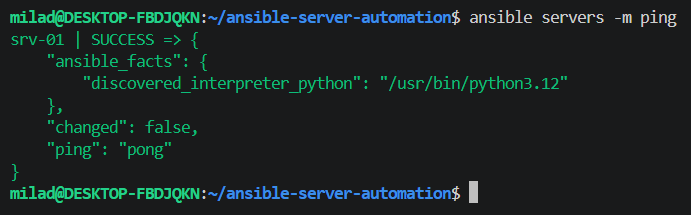
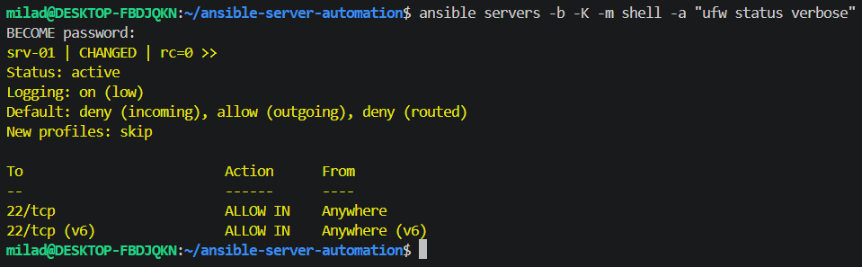
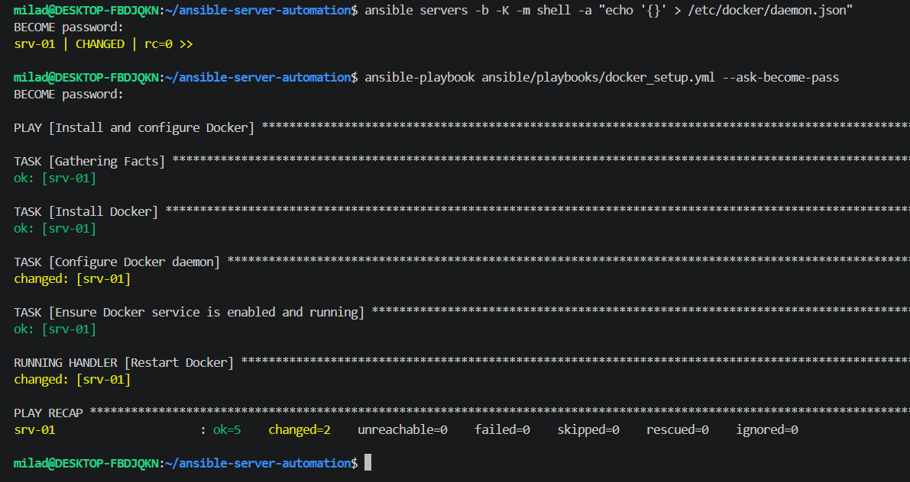
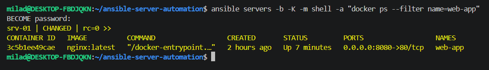
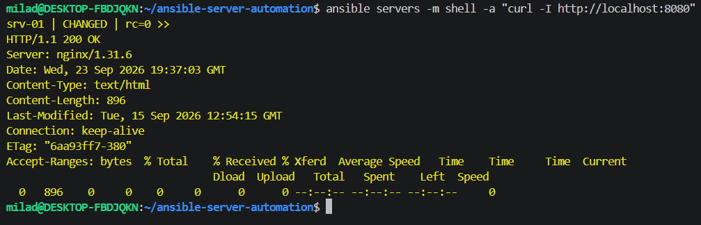
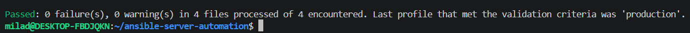

# Ansible Server Automation

A practical Ansible automation project for configuring and managing an Ubuntu Server from a WSL-based Ansible control node.

The project demonstrates server configuration, Docker installation, firewall management, container deployment, variables, handlers, idempotency, linting, and end-to-end validation.

## Architecture

```text
Windows Host
│
├── WSL2 Ubuntu
│   └── Ansible Control Node
│
└── VMware Workstation
    └── Ubuntu Server
        └── srv-01
```

Ansible connects from the WSL2 control node to the managed Ubuntu Server over SSH.

## Technologies

- Ansible
- Ubuntu Server
- WSL2
- VMware Workstation
- SSH
- Docker
- Nginx
- UFW
- Git
- GitHub
- ansible-lint

## Project Structure

```text
ansible-server-automation/
├── .gitignore
├── ansible.cfg
└── ansible/
    ├── inventory/
    │   ├── hosts.ini
    │   └── group_vars/
    │       └── all.yml
    └── playbooks/
        ├── base_setup.yml
        ├── docker_setup.yml
        ├── firewall_setup.yml
        └── deploy_app.yml
```

## Inventory

The managed server is defined in:

```text
ansible/inventory/hosts.ini
```

Example:

```ini
[servers]
srv-01 ansible_host=192.168.187.133 ansible_user=srv-01
```

## Ansible Configuration

The project uses a local `ansible.cfg` file:

```ini
[defaults]
inventory = ./ansible/inventory/hosts.ini
host_key_checking = True
interpreter_python = auto_silent
```

This allows Ansible commands to use the project inventory automatically.

## Variables

Application settings are stored in:

```text
ansible/inventory/group_vars/all.yml
```

Current variables:

```yaml
---
web_app_name: web-app
web_app_image: nginx:latest
web_app_host_port: 8080
web_app_container_port: 80
```

## Playbooks

### Base Server Setup

```text
ansible/playbooks/base_setup.yml
```

Responsibilities:

- Update the APT cache
- Install basic packages
- Install `curl`
- Install `git`
- Install `htop`

Run:

```bash
ansible-playbook ansible/playbooks/base_setup.yml --ask-become-pass
```

### Docker Setup

```text
ansible/playbooks/docker_setup.yml
```

Responsibilities:

- Install Docker
- Configure the Docker daemon
- Configure Docker log rotation
- Enable the Docker service
- Start the Docker service
- Restart Docker only when its configuration changes

The Docker configuration uses an Ansible handler, demonstrating event-driven service management.

Run:

```bash
ansible-playbook ansible/playbooks/docker_setup.yml --ask-become-pass
```

### Firewall Setup

```text
ansible/playbooks/firewall_setup.yml
```

Responsibilities:

- Allow SSH on TCP port 22
- Deny incoming traffic by default
- Allow outgoing traffic by default
- Enable UFW

Run:

```bash
ansible-playbook ansible/playbooks/firewall_setup.yml --ask-become-pass
```

### Application Deployment

```text
ansible/playbooks/deploy_app.yml
```

The deployment playbook runs an Nginx Docker container using variables defined in `group_vars`.

Current deployment:

```text
Container: web-app
Image: nginx:latest
Host Port: 8080
Container Port: 80
```

Run:

```bash
ansible-playbook ansible/playbooks/deploy_app.yml --ask-become-pass
```

## Connectivity Test

Verify that Ansible can reach the managed server:

```bash
ansible servers -m ping
```

Expected result:

```text
ping: pong
```

## Docker Validation

Check Docker:

```bash
ansible servers -b -K -m shell -a "systemctl is-active docker"
```

Expected result:

```text
active
```

Check the deployed container:

```bash
ansible servers -b -K -m shell -a "docker ps --filter name=web-app"
```

The `web-app` container should be in the `Up` state.

## HTTP Validation

Validate the deployed Nginx service:

```bash
ansible servers -m shell -a "curl -I http://localhost:8080"
```

Expected response:

```text
HTTP/1.1 200 OK
```

## Firewall Validation

Check the current UFW configuration:

```bash
ansible servers -b -K -m shell -a "ufw status verbose"
```

Validated state:

```text
Status: active
Default: deny (incoming), allow (outgoing)
22/tcp: ALLOW IN
```

## Idempotency

All playbooks were executed repeatedly to verify idempotent behavior.

Validated final runs completed with:

```text
changed=0
failed=0
```

This confirms that Ansible does not make unnecessary changes when the managed server is already in the desired state.

## Syntax Validation

All playbooks were validated using:

```bash
for f in ansible/playbooks/*.yml; do
  echo "Checking $f"
  ansible-playbook "$f" --syntax-check || exit 1
done
```

All syntax checks completed successfully.

## Ansible Lint

The playbooks were also validated using `ansible-lint`:

```bash
ansible-lint ansible/playbooks/*.yml
```

Final result:

```text
Passed: 0 failure(s), 0 warning(s) in 4 files processed of 4 encountered.
```

The project successfully met the `production` lint profile validation criteria.

## End-to-End Validation

The complete automation workflow was validated in the following order:

```text
Ansible Connectivity
        ↓
Base Server Setup
        ↓
Docker Installation and Configuration
        ↓
UFW Firewall Configuration
        ↓
Nginx Container Deployment
        ↓
HTTP Validation
```

Final validated state:

```text
Ansible connectivity: OK
Docker service: active
UFW firewall: active
SSH port 22: allowed
web-app container: Up
HTTP response: 200 OK
```

## Validation Evidence

### Ansible Connectivity



### Firewall Validation



### Docker Handler



### Container Deployment



### HTTP Validation



### Ansible Lint



## Security Notes

- SSH private keys are never committed to the repository.
- Passwords and credentials are not stored in playbooks.
- Privilege escalation passwords are requested interactively.
- SSH access is explicitly allowed before UFW is enabled.
- Sensitive files are excluded through `.gitignore`.

## Key Skills Demonstrated

- Ansible inventory management
- SSH-based configuration management
- Ansible ad-hoc commands
- Playbook development
- Variables and `group_vars`
- Handlers
- Idempotent automation
- Package management
- Service management
- Docker automation
- Docker container deployment
- Linux firewall automation
- Infrastructure validation
- Ansible syntax checking
- ansible-lint
- Git and GitHub workflow

## Status

Project implementation and end-to-end validation completed successfully.

